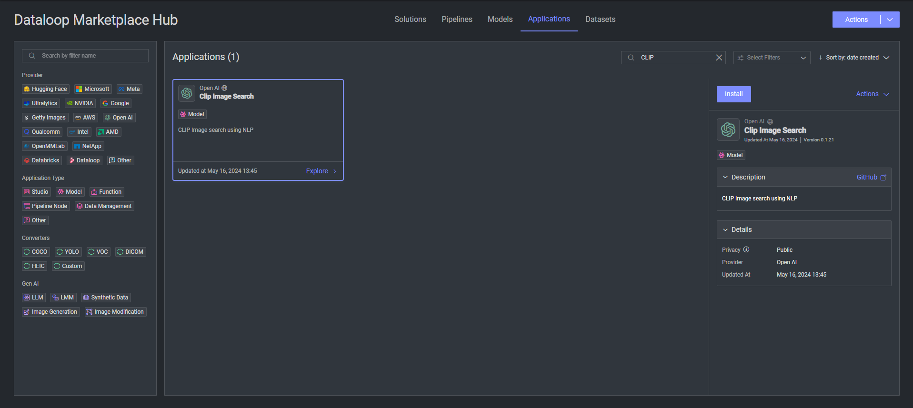
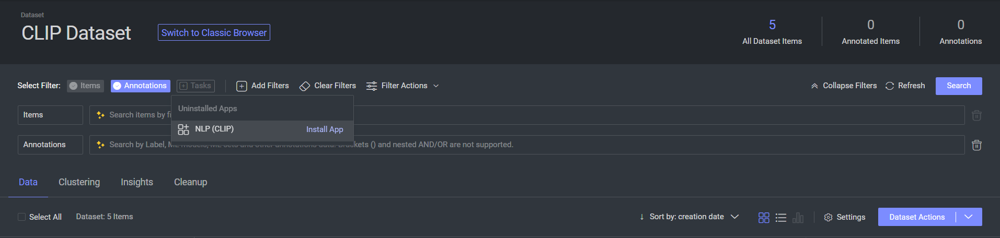
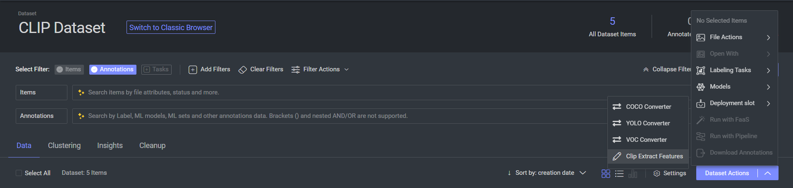
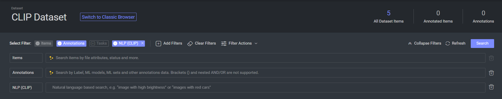

# Semantic (CLIP)

The Semantic (CLIP) application is a text based search for images and text files in a dataset that uses the CLIP model.

The application generates embeddings that are used to search based on similarity with the text queries.

## Model Details

The CLIP model was developed by researchers at OpenAI to learn about what contributes to robustness in computer vision
tasks. The model was also developed to test the ability of models to generalize to arbitrary image classification tasks
in a zero-shot manner. It was not developed for general model deployment - to deploy models like CLIP, researchers will
first need to carefully study their capabilities in relation to the specific context they’re being deployed within.

## Usage

### App installation:

There are multiple ways to install the Semantic (CLIP) application:

1. **From the Market Place**:
    - Go to the MarketPlace
    - Search for the Semantic (CLIP) application
    - Click on the application and click install button on the right hand side

2. **From the Dataset browser**:
    - Go to the dataset browser
    - Click on the `Add Filters` button.
    - Find the `Semantic (CLIP)` application in the dropdown menu.
    - Click on Install App button.

### Preprocessing:

CLIP Semantic search application comes with a preprocessing stage that generates embeddings for the images in the
dataset.

1. On App installation, a trigger is created that runs the preprocessing stage on every new item of supported mimetypes
   created.
2. For the existing items, you can run the preprocessing stage manually by following the steps below:
    - Go to the dataset browser
    - Click on `Dataset Actions`.
    - Click on the `Deployment Slots` button from the dropdown menu.
    - Click on the `Clip Extract Features` button.
    - Wait for the execution to finish, you can track the status in the notification bell.

### Supported Mimetypes:

Currently, the application supports the following mimetypes:

- image/jpeg
- image/png
- text/plain

### Searching:

Once the preprocessing is done, you can search for images using the search bar. The search bar supports text search.

You can install the Search bar by clicking on the `Add Filters` button in the dataset browser and
selecting `Semantic (CLIP)`
App.

Once the search bar is installed, You can write any text you want and click `search`.

The results of the search will be all the images and text files in the dataset sorted by the Euclidean distance between
the query and the embeddings of the items in the dataset.

## Contributions, Bugs and Issues - How to Contribute

We welcome anyone to help us improve this app.
Here's a detailed instructions to help you open a bug or ask for a feature request

