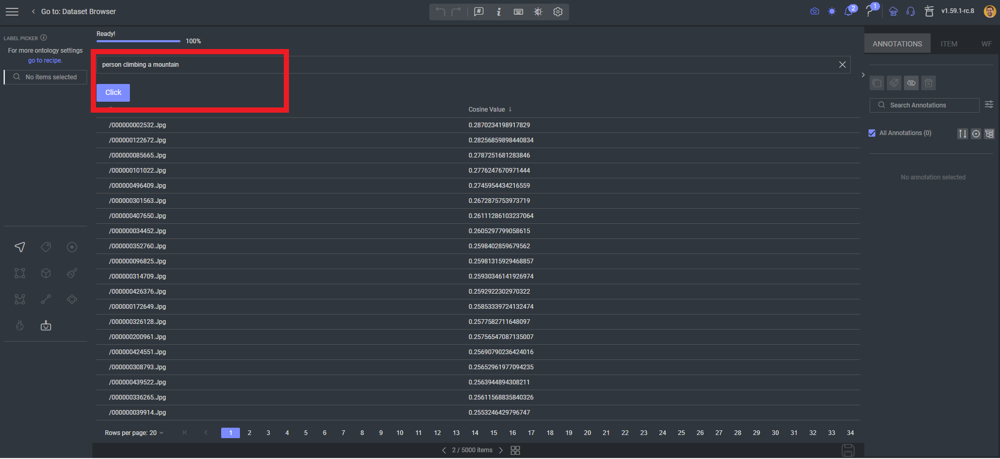

# Clip Smart Search

This is a Data Browser application to search images with free text.
Based on [OpenAI's work](https://github.com/openai/CLIP), we created an image and text embedding app with a similarity search.

POC is running in an item viewer slot and running the text embedding with a cosine similarity in the browser:

The results are in a sortable table by distance (higher is better), first result is:

## Next Steps

1. Run the app in a Databrowser slot
2. Use the feature management search 

## Contributions, Bugs and Issues - How to Contribute
We welcome anyone to help us improve this app.
Here's a detailed instructions to help you open a bug or ask for a feature request

